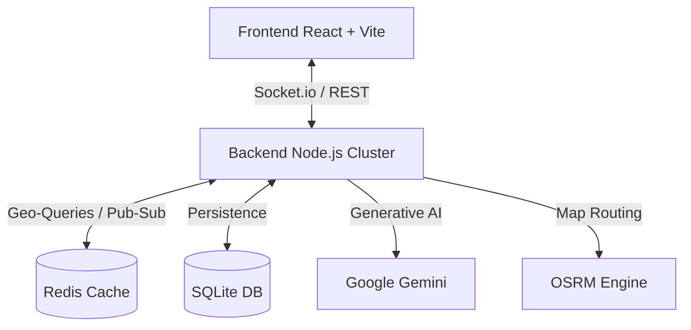

# 🚖 Zoomcab — High-Performance Distributed Ride-Hailing


Zoomcab is a distributed, high-availability ride-hailing platform engineered for the modern web. It combines **Distributed Computing Patterns**, **Real-time Geospatial Logic**, and **Generative AI** into a premium "Glassmorphism" interface.

---

## 🏛️ System Architecture

Zoomcab follows a decoupled service-oriented architecture, utilizing **Redis** as a high-speed inter-process communication (IPC) layer and **Socket.io** for bidirectional real-time event streaming.



---

## 🧠 Distributed Systems Mechanisms

Zoomcab is built to solve classic distributed systems challenges:

### 1. Resource Discovery (Geospatial Matching)
- **Problem**: Finding active drivers in a dynamic 2D space.
- **Solution**: We use **Redis Geospatial (GEO)**. Drivers heartbeat their coordinates into a geospatial index (`GEOADD`). The system queries nearby resources using `GEORADIUS` with a logarithmic complexity of **O(log(N))**.

### 2. Mutual Exclusion (The "Single Assign" Problem)
- **Problem**: Two riders matching with the same driver simultaneously.
- **Solution**: **Distributed Locking via Lua Scripts**. We execute atomic check-and-set operations directly on the Redis engine.
    - *Algorithm*: When a match is found, a Lua script checks if the driver's status is `available`. If yes, it atomically switches them to `matching` and returns a success token. No other process can intercept during this execution.

### 3. Leader Election (Bully Algorithm)
- **Problem**: Coordinating background tasks (like surge pricing calculation) across multiple server instances.
- **Solution**: The **Bully Algorithm**.
    - Each instance has a unique ID.
    - The instance with the highest ID elects itself as the Leader.
    - If the leader fails to heartbeat into Redis for >10 seconds, the next highest-ID instance identifies the failure and triggers a new election.

### 4. Deadlock & Race Condition Prevention
- **TTLs (Time-to-Live)**: All distributed locks and temporary "pending" states have an expiry (e.g., 30s). If a driver doesn't accept/reject within the window, the lock automatically clears, releasing the resource back to the pool.

---

## 📐 Mathematical Models

### 🏎️ Haversine Formula
For accurate ride tracking and pricing, we don't use simple Euclidean geometry. We implement the **Haversine Formula** to account for Earth's curvature:

$$d = 2r \arcsin\left(\sqrt{\sin^2\left(\frac{\phi_2 - \phi_1}{2}\right) + \cos(\phi_1) \cos(\phi_2) \sin^2\left(\frac{\lambda_2 - \lambda_1}{2}\right)}\right)$$

This ensures that a 5km ride is actually 5km on the map, not a flat-plane approximation.

### 📈 Surge Pricing Model
Prices fluctuate dynamically based on the **Demand-Supply Ratio ($K$)**:
$$Price = Base\_Fare \times \text{Multiplier}(K)$$
Where $K = \frac{\text{Active\_Riders}}{\text{Available\_Drivers} + 1}$ within a specific geo-hash region.

---

## 🤖 AI Features (Powered by Google Gemini)

Zoomcab integrates **Generative AI** to enhance the user and driver experience:
- **Rider Concierge**: A personalized AI assistant that can suggest destinations, estimate costs, and provide local travel tips.
- **Context-Aware Auto-Replies**: Using NLP, the driver-rider chat suggests quick replies (e.g., *"I'm at the main gate"* or *"Traffic is heavy, be there in 2 mins"*) based on the real-time conversation history.

---

## 🛡️ Safety & Premium UX

### 💎 Design System
- **Glassmorphism**: High-end UI with backdrop blurs, gradients, and subtle borders.
- **Micro-Animations**: Framer Motion used for smooth transitions between ride states.

### 🆘 Safety First
- **SOS Integrated**: One-tap emergency broadcast to police and emergency contacts.
- **Live Trip Sharing**: Generates a secure tracking URL for friends to monitor your ride in real-time.

---

## 📂 Database Schema (SQLite)

| Table | Primary Key | Description |
| :--- | :--- | :--- |
| `users` | `id` | Auth data, usernames, and roles (Rider/Driver). |
| `drivers` | `user_id` | Live status, vehicle type, and last known coordinates. |
| `rides` | `id` | Records of all trips, fares, and timestamps. |

---

## 🚀 Installation & Developer Guide

### Environment Setup
Create a `.env` file in the `/backend` directory:
```env
PORT=5000
REDIS_HOST=localhost
REDIS_PORT=6379
GEMINI_API_KEY=your_actual_key_here
```

### Running the Project
1. **Start Redis**: Ensure `redis-server` is running.
2. **Backend**: 
   ```bash
   cd backend && npm install && npm run dev
   ```
3. **Frontend**:
   ```bash
   cd frontend && npm install && npm run dev
   ```

---

## 📂 Project Structure

### 📁 `backend/`
- `rideMatchingService.js`: The heart of the platform. Handles geo-queries and assignment logic.
- `leaderElection.js`: Implementation of the Bully Algorithm for cluster coordination.
- `eventBus.js`: Redis-backed Pub/Sub for inter-service communication.
- `database.js`: SQLite initialization and schema definitions.
- `chatbot/`: Controllers and routes for the Gemini AI integration.

### 📁 `frontend/`
- `src/components/PageLayout.jsx`: The core Glassmorphism wrapper.
- `src/pages/Home.jsx`: The main rider map and destination selection.
- `src/pages/DriverDashboard.jsx`: Real-time earnings and activity hub for drivers.
- `src/lib/api.js`: Axios-based client with interceptors for JWT auth.
- `src/hooks/useSocket.js`: Custom hooks for real-time state synchronization.

---

## 🗺️ Roadmap & Distributed Future

- [ ] **Raft Consensus Integration**: Moving from Bully to Raft for even stronger consistency in driver states.
- [ ] **Sharded Redis Cluster**: Implementing horizontal scaling for the geospatial index.
- [ ] **AI Route Optimization**: Using Gemini to predict traffic patterns and proactively reroute drivers.
- [ ] **Blockchain Payments**: Integrating a decentralized ledger for transparent driver payouts.

---

*Zoomcab - Scalable. Reliable. Distributed.*
